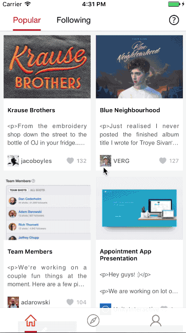
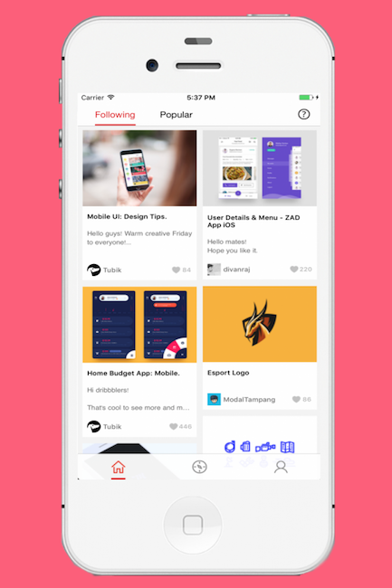
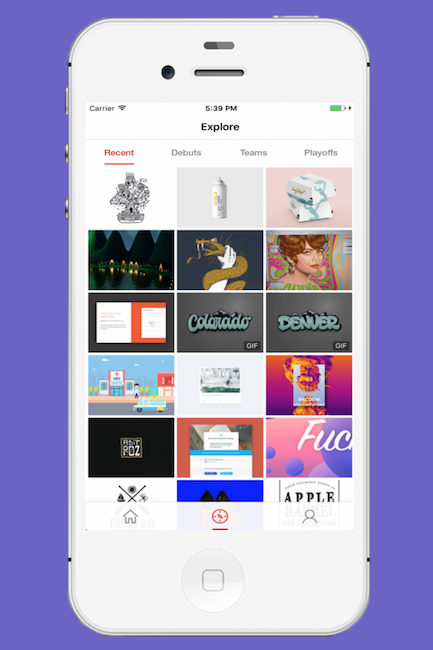
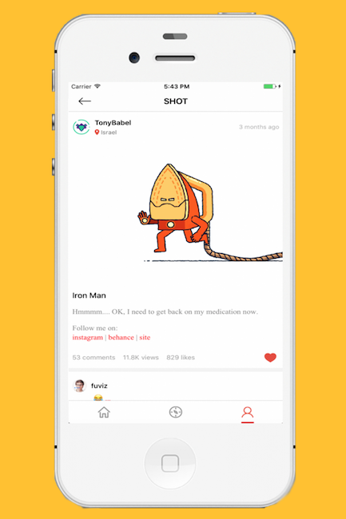
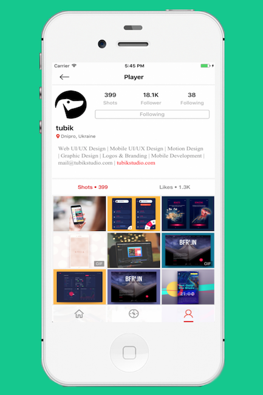

###Dribbble iOS app built with Objective-C.

A [Dribbble](http://dribbble.com) app build base on MVC.

Third Party Libary used:
- [SDWebImage](https://github.com/rs/SDWebImage)
- [AFNetworking](https://github.com/AFNetworking/AFNetworking)
- [MJExtension](https://github.com/CoderMJLee/MJExtension)
- [MJRefresh](https://github.com/CoderMJLee/MJRefresh)

####Todo List
- [x] Add Waterfall layout for the home View Controller
- [x] Parse html to text
- [x] Implement 'LIKE Shot' and 'FOLLOW Player' function 
- [x] Support Dribbble OAuth2 Login
- [x] Optimize Gif display and Optimize performance
- [ ] unexcepted error handler (off networking, crash and so on)
- [ ] Rewrite Swift3.0 Version
